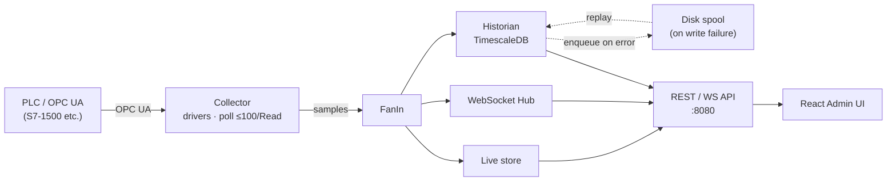
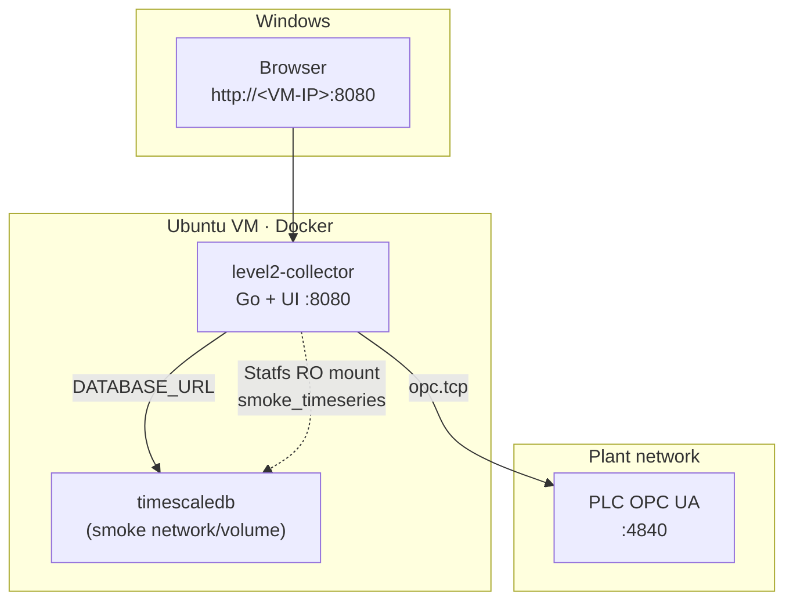
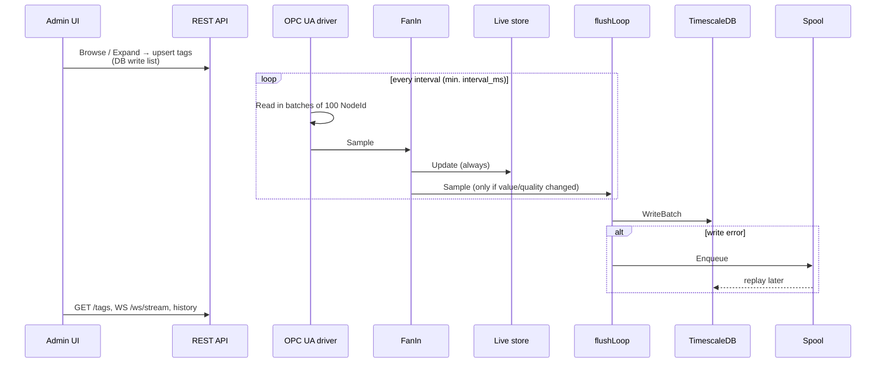

# Level2

Industrial data collection platform: **OPC UA collector (Go)** → **TimescaleDB** + **Admin UI (React)**.

Repository: https://github.com/popelev/level2

The collector polls leaf tags over OPC UA (batches of up to **100** nodes per Read), keeps live values in memory, writes history to TimescaleDB (`collector.samples`), and exposes a REST/WebSocket API. The React UI is served from the same `:8080`.

> The earlier Telegraf → Timescale → Grafana smoke stack lived in `deploy/smoke/`. The primary path is now the Go collector in `deploy/platform/`.

---

## How it works



**Data flow (short):**

1. Driver (OPC UA or SIM) reads enabled tags → samples channel.
2. `FanIn` updates Live + WS on every sample; forwards to the historian only when **value or quality** changed (Phase 1 suppress — [docs/opc-subscription-mode.md](docs/opc-subscription-mode.md)).
3. `flushLoop` writes batches to Timescale; on error — spool to disk and later replay.
4. API + UI read live/history/diagnostics/capacity.

---

## Deployment topology (lab)



The collector joins the same Docker network and Timescale instance as smoke (`smoke_default`, volume `smoke_timeseries`). Details: [deploy/platform/README.md](deploy/platform/README.md).

---

## Main write path (poll → DB)



---

## Main UI scenarios

Admin UI navigation (`http://<host>:8080/`):

| Group | Tabs |
|-------|------|
| — | **Overview** |
| Connectivity | **Servers**, **Address Space** |
| Data | **DB write list**, **Import / Export** |
| Config | **Projects**, **Database** |
| System | **Diagnostics**, **Capacity**, **Jenkins** (external `:8081`) |

**Typical tag workflow**

1. **Address Space** — browse the OPC tree (`GET /browse`), expand (`POST /expand`), pick leaf/folder → add to the poll list (DataType from OPC in batches; UI shows progress).
2. **DB write list** — enabled tags polled into Timescale; **Sync from OPC** overwrites datatypes (see [docs/opc-datatype-sync.md](docs/opc-datatype-sync.md)).
3. **Import / Export** — Excel tag list for one server (`…/tags.xlsx`, `…/tags/import`).
4. **Projects** — `Project.xlsx` (Servers + Tags), import merge/replace, validate/compare against Address Space.
5. **Overview / Diagnostics / Capacity / Database** — readiness pills, OPC/DB ring log, free DB space, lab **wipe samples**.
6. **Grafana** (smoke `:3000`) — template [OPC Structure Measure](deploy/smoke/grafana/README-opc-structure.md) (pick structure → value / scale / unit).

PLC-less mode: `LEVEL2_SIM_BROWSER=1` — in-memory browse/expand and synthetic samples.

---

## Key environment variables

| Variable | Purpose |
|----------|---------|
| `LEVEL2_SIM_BROWSER` | `1` — demo without PLC; `0` — live OPC UA |
| `DATABASE_URL` | PostgreSQL/Timescale DSN (set automatically in compose) |
| `PLC_OPC_ENDPOINT` | `opc.tcp://…:4840` |
| `OPC_UA_USERNAME` / `OPC_UA_PASSWORD` | OPC credentials (same as in UaExpert) |
| `LEVEL2_DB_CAPACITY_BYTES` | Optional absolute capacity limit (bytes); otherwise Statfs × `capacity_percent` |
| `LEVEL2_DB_CAPACITY_PERCENT` | Disk fraction 1–100 (YAML `database.capacity_percent`, default 90) |
| `LEVEL2_DB_FULL_POLICY` | `stop` \| `drop_oldest` \| `rotate` \| `expand_limit` — see [docs/db-capacity-policy.md](docs/db-capacity-policy.md) |
| `LEVEL2_DB_DATA_PATH` | DB data path inside the collector (default `/var/lib/level2/dbdisk`) |

Example: [deploy/platform/.env.example](deploy/platform/.env.example).

---

## Quick start

Full runbook is not duplicated here — see **[deploy/platform/README.md](deploy/platform/README.md)**.

Short version:

```bash
# 1) Timescale from smoke (network + volume), if not already up
cd deploy/smoke && docker compose up -d timescaledb   # if needed

# 2) Platform collector
cd deploy/platform
cp -n config.example.yaml config.yaml
cp -n .env.example .env
# PLC off: LEVEL2_SIM_BROWSER=1
# PLC on:  LEVEL2_SIM_BROWSER=0 + OPC credentials
docker compose build
docker compose up -d
curl -s http://127.0.0.1:8080/healthz
# UI: http://<vm-ip>:8080/
```

- **PLC off** — sim browser + synthetic samples (`verify_offline.sh`).
- **PLC on** — `LEVEL2_SIM_BROWSER=0`, credentials, `verify_plc_on.sh`; stop Telegraf smoke to avoid duplicate writes.

Legacy connectivity smoke (Telegraf + Grafana): [deploy/smoke/README.md](deploy/smoke/README.md).

---

## API (highlights)

Full table: [deploy/platform/README.md](deploy/platform/README.md#api).

| Method | Path | Notes |
|--------|------|-------|
| GET | `/healthz`, `/readyz` | liveness / readiness |
| GET | `/api/v1/status/summary` | summary for UI pills |
| GET | `/api/v1/tags`, `/api/v1/tags/{id}/value` | live |
| GET | `/api/v1/tags/{id}/history` | Timescale |
| GET | `/api/v1/browse`, POST `/api/v1/expand` | Address Space |
| GET/POST | `/api/v1/devices/…/tags…` | CRUD / import / export / sync |
| GET | `/api/v1/ws/stream` | live WebSocket |
| GET | `/api/v1/diagnostics/logs` | ring log |
| GET | `/api/v1/database/status` | DB status / capacity |
| POST | `/api/v1/database/wipe-samples?confirm=wipe` | wipe historian samples (lab); optional `{"clear_tags":true}` |
| GET | `/metrics` | Prometheus |

Writing values to the PLC (`PUT /api/v1/tags/{id}/value`) is still **501** — design: [docs/opc-write-mode.md](docs/opc-write-mode.md). On-change historian / subscription: [docs/opc-subscription-mode.md](docs/opc-subscription-mode.md). Datatype expand + Sync: [docs/opc-datatype-sync.md](docs/opc-datatype-sync.md). External programs (Python/C#/JS/…) as HTTP/WS clients: [docs/external-client-api.md](docs/external-client-api.md). Capacity / wipe: [docs/db-capacity-policy.md](docs/db-capacity-policy.md).

---

## Repository layout

```
cmd/collector/          # collector entrypoint
internal/               # drivers, api, historian, spool, store, …
web/                    # React Admin UI
deploy/platform/        # Docker Compose + runbook (primary path)
deploy/smoke/           # Telegraf smoke (legacy connectivity)
deploy/ci/              # Jenkins CI/CD skeleton (lab VM, port 8081)
Jenkinsfile             # Declarative pipeline (Phase 1: test + image build)
```

CI/CD (Jenkins): [deploy/ci/README.md](deploy/ci/README.md).
