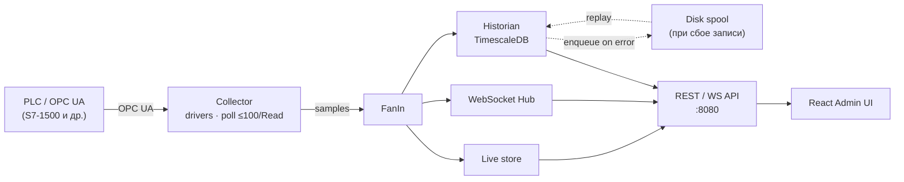
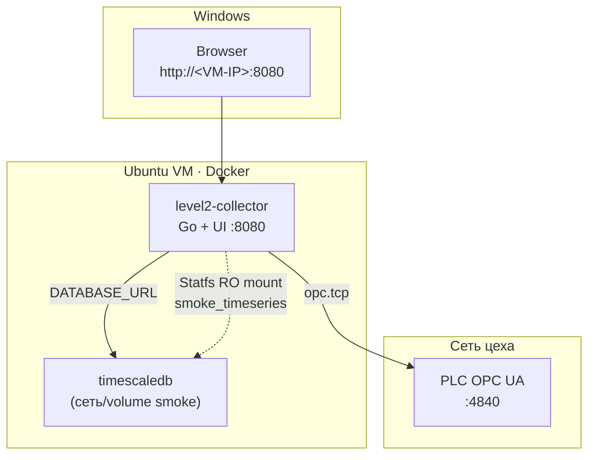
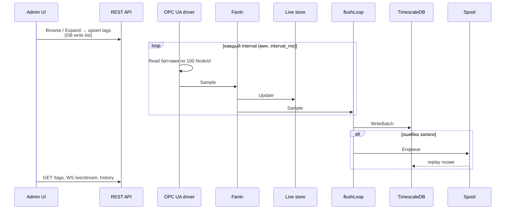

# Level2

Платформа промышленного сбора данных: **OPC UA collector (Go)** → **TimescaleDB** + **Admin UI (React)**.

Репозиторий: https://github.com/popelev/level2

Collector опрашивает leaf-теги по OPC UA (батчами до **100** узлов на Read), держит live-значения в памяти, пишет историю в TimescaleDB (`collector.samples`) и отдаёт REST/WebSocket API. React UI обслуживается с того же `:8080`.

> Ранее smoke-стек Telegraf → Timescale → Grafana жил в `deploy/smoke/`. Основной путь сейчас — Go collector в `deploy/platform/`.

---

## Как это устроено



**Поток данных (кратко):**

1. Driver (OPC UA или SIM) читает enabled-теги → канал samples.
2. `FanIn` обновляет live store, шлёт в WS и в буфер historian.
3. `flushLoop` пишет батчи в Timescale; при ошибке — spool на диск и последующий replay.
4. API + UI читают live/history/diagnostics/capacity.

---

## Топология развёртывания (лаб)



Collector подключается к той же Docker-сети и Timescale, что и smoke (`smoke_default`, volume `smoke_timeseries`). Подробности — в [deploy/platform/README.md](deploy/platform/README.md).

---

## Основной путь записи (poll → DB)



---

## Основные сценарии UI

Навигация Admin UI (`http://<host>:8080/`):

| Группа | Вкладки |
|--------|---------|
| — | **Overview** |
| Connectivity | **Servers**, **Address Space** |
| Data | **DB write list**, **Import / Export** |
| Config | **Projects**, **Database** |
| System | **Diagnostics**, **Capacity** |

**Типичный поток тегов**

1. **Address Space** — browse дерева OPC (`GET /browse`), expand (`POST /expand`), выбор leaf → запись в список опроса.
2. **DB write list** — enabled-теги, которые реально поллятся и пишутся в Timescale; live-значения обновляются в UI.
3. **Import / Export** — Excel списка тегов на один сервер (`…/tags.xlsx`, `…/tags/import`).
4. **Projects** — `Project.xlsx` (Servers + Tags), import merge/replace, validate/compare против Address Space.
5. **Overview / Diagnostics / Capacity / Database** — сводка готовности и качества, кольцевой лог OPC/DB, свободное место БД, статус `DATABASE_URL`.

Режим без PLC: `LEVEL2_SIM_BROWSER=1` — in-memory browse/expand и синтетические samples.

---

## Ключевые переменные окружения

| Переменная | Назначение |
|------------|------------|
| `LEVEL2_SIM_BROWSER` | `1` — demo без PLC; `0` — живой OPC UA |
| `DATABASE_URL` | PostgreSQL/Timescale DSN (в compose задаётся автоматически) |
| `PLC_OPC_ENDPOINT` | `opc.tcp://…:4840` |
| `OPC_UA_USERNAME` / `OPC_UA_PASSWORD` | Учётные данные OPC (как в UaExpert) |
| `LEVEL2_DB_CAPACITY_BYTES` | Опциональный лимит ёмкости (байты); иначе Statfs по смонтированному volume |
| `LEVEL2_DB_DATA_PATH` | Путь к данным БД внутри collector (по умолчанию `/var/lib/level2/dbdisk`) |

Пример: [deploy/platform/.env.example](deploy/platform/.env.example).

---

## Быстрый старт

Не дублируем полный runbook — см. **[deploy/platform/README.md](deploy/platform/README.md)**.

Кратко:

```bash
# 1) Timescale из smoke (сеть + volume), если ещё не поднят
cd deploy/smoke && docker compose up -d timescaledb   # по необходимости

# 2) Platform collector
cd deploy/platform
cp -n config.example.yaml config.yaml
cp -n .env.example .env
# PLC off: LEVEL2_SIM_BROWSER=1
# PLC on:  LEVEL2_SIM_BROWSER=0 + OPC credentials
docker compose build
docker compose up -d
curl -s http://127.0.0.1:8080/healthz
# UI: http://<vm-ip>:8080/
```

- **PLC off** — sim browser + synthetic samples (`verify_offline.sh`).
- **PLC on** — `LEVEL2_SIM_BROWSER=0`, credentials, `verify_plc_on.sh`; остановите Telegraf smoke, чтобы не дублировать запись.

Старый connectivity-smoke (Telegraf + Grafana): [deploy/smoke/README.md](deploy/smoke/README.md).

---

## API (highlights)

Полная таблица — в [deploy/platform/README.md](deploy/platform/README.md#api).

| Method | Path | Notes |
|--------|------|-------|
| GET | `/healthz`, `/readyz` | liveness / readiness |
| GET | `/api/v1/status/summary` | сводка для UI pills |
| GET | `/api/v1/tags`, `/api/v1/tags/{id}/value` | live |
| GET | `/api/v1/tags/{id}/history` | Timescale |
| GET | `/api/v1/browse`, POST `/api/v1/expand` | Address Space |
| GET/POST | `/api/v1/devices/…/tags…` | CRUD / import / export / sync |
| GET | `/api/v1/ws/stream` | live WebSocket |
| GET | `/api/v1/diagnostics/logs` | кольцевой лог |
| GET | `/api/v1/database/status` | статус БД / capacity |
| GET | `/metrics` | Prometheus |

Запись значений в PLC (`PUT /api/v1/tags/{id}/value`) пока **501** (фаза write не реализована).

---

## Структура репозитория

```
cmd/collector/          # точка входа collector
internal/               # drivers, api, historian, spool, store, …
web/                    # React Admin UI
deploy/platform/        # Docker Compose + runbook (основной путь)
deploy/smoke/           # Telegraf smoke (legacy connectivity)
deploy/ci/              # Jenkins CI/CD skeleton (лаб VM, порт 8081)
Jenkinsfile             # Declarative pipeline (Phase 1: test + image build)
```

CI/CD (Jenkins): [deploy/ci/README.md](deploy/ci/README.md).

---

## English (short)

**Level2** is an OPC UA → TimescaleDB collector with a React admin console on `:8080`. Polls leaf tags in batches of **100**, fans samples into a live store + historian (with disk spool on write failure). Lab topology: Windows browser → Ubuntu VM Docker (collector + Timescale from smoke network) → PLC on the plant network. Quick start and full API table: [deploy/platform/README.md](deploy/platform/README.md).
