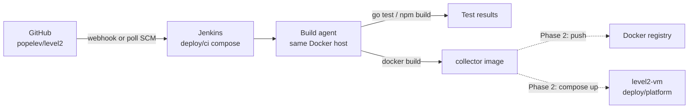

# Level2 CI/CD via Jenkins

Planning and bootstrap for Jenkins next to the lab stack (same VM / Docker network).

**Status:** Phase 1 skeleton — CI checks + image build. Deploy stages are commented / gated. No production secrets in-repo.

## Goals

| Goal | Phase | Notes |
|------|-------|--------|
| PR / `main` checks | 1 | `go test ./...`, UI `npm ci` + `npm run build` |
| Build collector image | 1 | `deploy/platform/Dockerfile` (context repo root) |
| Optional image push | 2 | Private registry or local tag only |
| Optional deploy to level2-vm | 2 | `docker compose` in `deploy/platform/` — **gated**, does not replace manual lab flow |

Out of scope for CI: live OPC UA / PLC credentials, Grafana dashboards, smoke Telegraf.

## Architecture



Recommended layout on the lab VM:

```
level2/
  Jenkinsfile                 # Declarative pipeline (repo root)
  deploy/
    ci/
      docker-compose.yml      # Jenkins LTS + docker.sock
      Dockerfile.jenkins      # LTS + Docker CLI
      README.md               # this file
    platform/                 # existing collector stack (unchanged)
    smoke/                    # existing Timescale/Grafana (unchanged)
```

## Recommended Jenkins layout

Run Jenkins from `deploy/ci/` on the **same host** as the Level2 compose stacks:

```bash
cd deploy/ci
docker compose up -d --build
# UI: http://<vm-ip>:8081/  (8080 is reserved for collector)
```

Image: `Dockerfile.jenkins` = Jenkins LTS + Docker CLI (sibling builds via socket).

### Docker builds without nested DinD

Mount the host Docker socket into Jenkins (`/var/run/docker.sock`). The controller then runs **sibling** containers for:

- `golang:1.24` → `go test ./...` (`GOTOOLCHAIN=auto`, matches `deploy/platform/README.md`)
- `node:22-bookworm` → `npm ci` / `npm run build` under `web/`
- `docker build -f deploy/platform/Dockerfile` → collector + embedded UI (same as platform compose)

Alternatives (later):

- **Docker Pipeline plugin** `agent { docker { image 'golang:1.24' } }` for isolated stages
- True DinD only if socket mount is unacceptable (heavier, needs privileged)

Do **not** put Jenkins on the public internet; bind to LAN / VPN only.

## Pipeline stages

Root [`Jenkinsfile`](../../Jenkinsfile) (Declarative):

| Stage | Command / action | Paths |
|-------|------------------|--------|
| Checkout | SCM (Multibranch / Pipeline from SCM) | — |
| Go Test | `go test ./...` in `golang:1.24` | `go.mod`, all packages |
| Web Build | `npm ci` && `npm run build` in `node:22-bookworm` | `web/` |
| Docker Build | `docker build -f deploy/platform/Dockerfile -t level2-collector:ci-$GIT_COMMIT .` | Dockerfile multi-stage (UI + Go) |
| Push *(optional)* | `docker push …` | gated by `ENABLE_PUSH=true` |
| Deploy *(optional)* | `docker compose -f deploy/platform/docker-compose.yml up -d --build` | gated by `ENABLE_DEPLOY=true` + branch `main` |

Acceptance scripts (`verify_offline.sh`, `verify_plc_on.sh`) stay **manual / lab-only** — they need a running stack and optionally PLC.

## Secrets

| Secret | Needed for CI? | How |
|--------|----------------|-----|
| GitHub credentials / webhook token | Yes (clone + trigger) | Jenkins Credentials; Multibranch GitHub App or username+PAT |
| OPC UA user/password | **No** for unit CI | Stay in `deploy/platform/.env` / smoke only |
| `DATABASE_URL` | Optional | Only if you add integration tests against Timescale; not required for `go test ./...` today |
| Registry credentials | Phase 2 only | Jenkins Credentials, never commit |
| Deploy SSH / compose host | Phase 2 only | Prefer same-host compose via socket; avoid storing OPC in Jenkins |

Do not commit `.env`, PLC passwords, or Jenkins admin password. Initial admin password is printed once in the Jenkins container logs.

## Triggers

1. **GitHub webhook** (preferred): Multibranch Pipeline → GitHub hook trigger for GITScm polling / GitHub plugin.
2. **Poll SCM** fallback: e.g. `H/5 * * * *` if webhook cannot reach the lab VM.
3. **Multibranch Pipeline**: discover `main` + PR branches; build PRs without deploy.

Suggested job: Multibranch from `https://github.com/popelev/level2.git`, Script Path `Jenkinsfile`.

## Security notes

- Do not expose Jenkins publicly; firewall / VPN; change default admin password.
- Use a GitHub PAT or App with least privilege (contents read; optionally commit status write).
- Pipeline must not `git push --force` or rewrite history.
- Socket mount grants Jenkins host-Docker power — treat the Jenkins UI as highly privileged.
- Keep Phase 2 deploy behind an explicit parameter / credential check so PR builds cannot redeploy the lab.

## Phased rollout

### Phase 1 — CI only (this skeleton)

1. `docker compose up -d --build` in `deploy/ci/`.
2. Create Multibranch job pointing at the repo / `Jenkinsfile`.
3. Enable builds on `main` and PRs: Go test, Web build, Docker build.
4. No auto-deploy; no registry push required.

### Phase 2 — Auto-deploy to lab VM

1. Add registry or local image tagging convention.
2. Enable `ENABLE_DEPLOY` only on `main` after green CI.
3. Deploy via existing `deploy/platform/docker-compose.yml` (external `smoke_default` / `smoke_timeseries` unchanged).
4. Optionally call `verify_offline.sh` post-deploy (still no OPC secrets in Jenkins).

## Quick start (Jenkins only)

```bash
cd ~/level2/deploy/ci
docker compose up -d --build
docker compose logs -f jenkins   # copy initialAdminPassword when prompted
# Open http://<vm-lan-ip>:8081/
```

Then in Jenkins UI: install suggested plugins → Multibranch Pipeline → this repository → Script Path `Jenkinsfile`.

Existing smoke/platform stacks are untouched; Jenkins uses host port **8081**.

## Sample pipeline reference

See repository root [`Jenkinsfile`](../../Jenkinsfile). It mirrors real paths:

- Go module: `go.mod` (toolchain via `GOTOOLCHAIN=auto`)
- UI: `web/package.json`, `web/package-lock.json`
- Image: `deploy/platform/Dockerfile` (same as `deploy/platform/docker-compose.yml` build)
