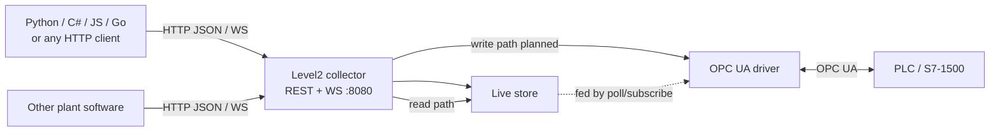

# External clients: talking to Level2 over HTTP / WebSocket

Design for **third-party programs** (any language) that read or write process variables through Level2’s REST/WebSocket API. Level2 stays the **OPC UA gateway**: clients never embed an OPC stack; they call `:8080`, and the collector talks to the PLC.

**Status:** reads and discovery work today (lab-open API). PLC writes are planned — see [opc-write-mode.md](opc-write-mode.md) (`PUT` currently **501**). This document is the client-facing contract plan; it does not ship OpenAPI generators or SDKs yet.

Related: [opc-subscription-mode.md](opc-subscription-mode.md) (historian on-change / subscribe), [opc-datatype-sync.md](opc-datatype-sync.md) (Sync / expand types), [db-capacity-policy.md](db-capacity-policy.md).

---

## 1. Role of Level2



| Layer | Responsibility |
|-------|----------------|
| External client | Bind to `tag_id` (or discover devices/tags), GET live / history / WS, later PUT write |
| Level2 API | Stable JSON over HTTP; resolve tags; gate writes; diagnostics |
| OPC driver | Batch Read (today); Write (planned) to Siemens / OPC UA |
| PLC | Authoritative process values and AccessLevel |

**Why not OPC in every client?** One place for credentials, NodeIds, coercion, reconnect, and audit. Clients stay thin HTTP callers on the lab LAN (or later behind a token).

---

## 2. Current API (as-is)

Base URL (lab VM): `http://<host>:8080`. Same origin serves the React Admin UI.

| Area | Today |
|------|--------|
| REST | `/api/v1/...` mounted in `internal/api` (`Mount`, project, diagnostics, database, status, tag bulk). |
| Live read | `GET /api/v1/tags`, `GET /api/v1/tags/{id}/value` — in-memory Live store. |
| History | `GET /api/v1/tags/{id}/history?from=&to=&limit=` — Timescale. |
| Discovery | `GET /api/v1/devices`, tags list, `GET /api/v1/browse`, `POST /api/v1/expand`, project/xlsx import-export. |
| Write | `PUT /api/v1/tags/{id}/value` → **501** stub. |
| WebSocket | `GET /api/v1/ws/stream` — fan-out of every Live sample (JSON text frames). |
| Auth | **None** — open lab API. Anyone who can reach `:8080` can read (and mutate config endpoints). |
| CORS | **No** dedicated CORS middleware. Browser cross-origin calls from another origin will fail unless same-origin or a reverse proxy adds headers. Non-browser clients (curl, Python `requests`, C# `HttpClient`) are unaffected. |
| OpenAPI / Swagger | **None** yet. Endpoint table: [deploy/platform/README.md](../deploy/platform/README.md#api). |
| WS origin | `CheckOrigin: true` (accept all) — fine for lab; revisit with auth. |

Full operator table: [deploy/platform/README.md](../deploy/platform/README.md#api). Highlights: [README.md](../README.md#api-highlights).

### 2.1. Sample JSON shape (stable for clients)

Single sample / WS message / history row:

```json
{
  "time": "2026-08-06T12:00:00.123Z",
  "tag_id": "opc_measure_rvalue",
  "value_num": 42.5,
  "value_text": null,
  "value_bool": null,
  "quality": 0
}
```

| Field | Notes |
|-------|--------|
| `time` | RFC3339 UTC from collector clock / OPC source time mapping. |
| `tag_id` | Configured tag id (client binding key). |
| `value_num` / `value_text` / `value_bool` | At most one payload typically set; omitempty on nulls. |
| `quality` | `0` = Good, `1` = Bad (coarse; not full OPC StatusCode). |

`GET /api/v1/tags` returns an array of tag rows with nested config + optional sample:

```json
{
  "device_id": "s7_1500",
  "tag": { "id": "...", "node_id": "ns=4;i=4208", "path": "...", "datatype": "float64", "enabled": true, "interval_ms": 1000 },
  "sample": { "time": "...", "tag_id": "...", "value_num": 1.0, "quality": 0 },
  "updated_at": "...",
  "poll_avg_ms": 980
}
```

Filter: `?device_id=s7_1500`.

### 2.2. WebSocket stream

```text
GET /api/v1/ws/stream
Upgrade: websocket
```

- Server pushes **one JSON sample object per message** (same DTO as above) whenever FanIn updates Live (every poll/subscribe sample, including unchanged values).
- Client → server: any message keeps the connection alive; disconnect ends the session. **No** subscribe filter / tag list yet (broadcast all).
- For selective updates today: open WS and ignore unwanted `tag_id`s, or poll `GET .../value`.

---

## 3. Read paths (client recipes)

### 3.1. One live sample

```http
GET /api/v1/tags/{tag_id}/value
```

- **200** + sample DTO.
- **404** if unknown tag or no sample yet (tag may exist in config but never polled).

### 3.2. Batch / inventory

```http
GET /api/v1/tags
GET /api/v1/tags?device_id=s7_1500
```

Use for binding UIs and multi-tag dashboards. Prefer this over N parallel GETs for small/medium lists.

### 3.3. Streaming

```http
GET /api/v1/ws/stream
```

Best for HMIs / scripts that need continuous updates without hammering REST.

**Future (optional):** query `?tag_id=a&tag_id=b` or a first client message `{"subscribe":["a","b"]}` to reduce fan-out — not required for lab MVP.

### 3.4. History

```http
GET /api/v1/tags/{tag_id}/history?from=2026-08-06T00:00:00Z&to=2026-08-06T12:00:00Z&limit=1000
```

RFC3339 `from` / `to`; `limit` caps rows. **503** if historian unavailable.

### 3.5. Health before read

| Endpoint | Use |
|----------|-----|
| `GET /healthz` | Process up |
| `GET /readyz` | Ready to serve (OPC connected when not sim) |
| `GET /api/v1/status/summary` | Quality counts, recent errors, write rates |
| `GET /api/v1/diagnostics/logs?category=&errors_only=&limit=` | Ring log; `category` = `all` \| `opc_read` \| `db_write` (aliases `opc` / `db`). OPC includes failures + ~30s `opc poll ok` |
| `POST /api/v1/diagnostics/reset` | Clear diagnostics ring + last-hour incident counters (Overview alarms) |
| `GET /api/v1/devices` | `connected` per device |

---

## 4. Write paths (planned)

**Do not implement OPC in the client.** Write through Level2 once [opc-write-mode.md](opc-write-mode.md) ships.

### 4.1. Single write (MVP target)

```http
PUT /api/v1/tags/{tag_id}/value
Content-Type: application/json

{ "value": 42.5, "device_id": "s7_1500" }
```

Today: **501**. After MVP: coercion + OPC Write; gated by `opc_write_enabled` (**403** when off). Error table and body forms live in the write design doc (§4).

### 4.2. Batch write (Phase 2 of write doc)

```http
POST /api/v1/tags/values
{ "writes": [ { "tag_id": "A", "value": 1 }, { "tag_id": "B", "value": true } ] }
```

Partial success per item; chunked OPC writes.

### 4.3. Idempotency notes

- OPC Write is **not** automatically idempotent across retries: a second PUT after a lost HTTP response may write again (usually harmless for setpoints; dangerous for edge-triggered commands).
- Clients should treat success as “accepted by Level2/OPC”, not a distributed transaction.
- **Recommendation:** avoid silent client retries on timeout without checking live/readback; prefer `verify` (write-doc Phase 3) when it exists.
- No `Idempotency-Key` header today; optional later if command-style tags appear.

---

## 5. Discovery & binding

Clients should bind to **stable `tag_id`** (and optional `device_id`), not raw NodeIds, unless doing Address Space tooling.

| Goal | Endpoint |
|------|----------|
| List devices + connection | `GET /api/v1/devices` |
| List tags + live | `GET /api/v1/tags?device_id=` |
| OPC tree walk | `GET /api/v1/browse?node_id=` (+ `device_id` when multi-device) |
| Expand subtree → tags | `POST /api/v1/expand` |
| Bulk tag CRUD / sync | `POST/PUT/DELETE …/devices/{id}/tags…`, `…/tags/sync` |
| Plant Excel | `GET/POST …/tags.xlsx`, project xlsx under `/api/v1/project…` |

Config-mutating endpoints are for engineering tools and the Admin UI — external *runtime* clients should usually **read/write values only**, not reshape the tag list.

---

## 6. Contract expectations

### 6.1. Stability

- Keep `/api/v1` JSON field names backward compatible; add fields with omitempty rather than renames.
- Breaking changes → `/api/v2` or documented migration.
- Errors today are mostly **plain text** bodies (`http.Error`). Prefer evolving write/read failures toward a small JSON error object when touching those handlers:

```json
{ "error": "opc_write_disabled", "message": "OPC write is disabled (opc_write_enabled=false)" }
```

Until then, clients should branch on **HTTP status** first, then parse body as text or JSON.

### 6.2. Suggested status meanings (reads + future writes)

| HTTP | Typical meaning |
|------|-----------------|
| 200 / 201 / 204 | OK |
| 400 | Bad JSON / coercion |
| 403 | Feature gated (e.g. write disabled) or future authz |
| 404 | Unknown tag / no sample |
| 409 | Conflict (e.g. device disconnected on write) |
| 501 | Not implemented (write stub) |
| 502 | Upstream OPC failure |
| 503 | Dependency down (historian, config store) |

### 6.3. Content type

Request bodies: `application/json` (except multipart Excel import). Responses: `application/json` unless file download.

---

## 7. Auth (phased)

| Phase | Behavior |
|-------|----------|
| **Lab now** | Open. Network isolation / firewall is the boundary. |
| **Phase A** | Optional shared **API token** (`Authorization: Bearer …` or `X-API-Key`) for all `/api/v1/*` mutating routes; reads may stay open or use the same token. |
| **Phase B** | Split **read** vs **write** (and config) roles; map to write gate in opc-write-mode. |
| **Later** | TLS termination at reverse proxy; Basic or OIDC if the plant requires it. |

Document clearly: with write enabled and no auth, **anyone on the lab network can change PLC values**.

WebSocket auth: pass token as query `?token=` or first message — decide when Phase A lands (browsers cannot set arbitrary Upgrade headers easily).

---

## 8. Language-agnostic usage

Any stack with an HTTP client works. No official SDK required for lab work.

### 8.1. curl

```bash
# Live one tag
curl -s "http://127.0.0.1:8080/api/v1/tags/opc_measure_rvalue/value"

# All tags on a device
curl -s "http://127.0.0.1:8080/api/v1/tags?device_id=s7_1500"

# History
curl -s "http://127.0.0.1:8080/api/v1/tags/opc_measure_rvalue/history?from=2026-08-06T00:00:00Z&limit=100"

# Write (after MVP; expects 501 today)
curl -s -X PUT "http://127.0.0.1:8080/api/v1/tags/Motor1.SpeedSP/value" \
  -H "Content-Type: application/json" \
  -d '{"value":42.5,"device_id":"s7_1500"}'
```

WebSocket (example with `websockets` CLI or browser): connect to `ws://127.0.0.1:8080/api/v1/ws/stream`.

### 8.2. Python (stdlib + optional requests)

```python
import json, urllib.request

base = "http://127.0.0.1:8080"

def get_json(path: str):
    with urllib.request.urlopen(base + path) as r:
        return json.load(r)

sample = get_json("/api/v1/tags/opc_measure_rvalue/value")
print(sample["tag_id"], sample.get("value_num"), sample["quality"])

# After write MVP:
# req = urllib.request.Request(
#     base + "/api/v1/tags/Motor1.SpeedSP/value",
#     data=json.dumps({"value": 42.5, "device_id": "s7_1500"}).encode(),
#     headers={"Content-Type": "application/json"},
#     method="PUT",
# )
# urllib.request.urlopen(req)
```

C# / JS / Go: same URLs and JSON; use `HttpClient`, `fetch`, or `net/http`. Prefer `tag_id` from `GET /api/v1/tags` rather than hard-coding NodeIds.

---

## 9. Safety for external writers

Aligned with [opc-write-mode.md](opc-write-mode.md) §5:

1. **`opc_write_enabled`** global gate (default off in code).
2. **Diagnostics** category `opc_write` for every attempt (when implemented).
3. **Confirm** is a UI concern; API clients are responsible for their own operator confirmations.
4. **Rate limits** — not implemented. Optional later (per-IP / per-token token bucket) if scripts spam writes; lab can start with process discipline.
5. Siemens **UserAccessLevel** remains the hard deny.
6. Prefer not exposing config DELETE/import to untrusted networks even before token auth.

Reads are cheap relative to OPC; still avoid tight loops on `GET .../value` when WS is available.

---

## 10. Non-goals

- Embedding **gopcua** / OPC UA stacks in Python/C#/JS client apps.
- Per-language **official SDKs** in MVP (optional thin wrappers later).
- Generating **OpenAPI** in this phase (document endpoints; export later).
- Full **RBAC**, multi-tenant isolation, or public Internet exposure without a proxy.
- Client-side recipe engines / multi-tag transactions with rollback.
- Replacing the Admin UI — external API complements it.

---

## 11. Phased plan

### Phase 0 — this document

- [x] Describe gateway role, current read/WS/discovery surface, auth/CORS/OpenAPI reality.
- [x] Cross-link write design, README, platform API table.
- [ ] Keep endpoint table in `deploy/platform/README.md` as the living inventory until OpenAPI exists.

### Phase 1 — usable as a lab integration API (docs + current code)

1. Treat sample DTO + `tag_id` as the public contract; avoid breaking field renames.
2. Ship PLC write MVP per [opc-write-mode.md](opc-write-mode.md); external clients use the same PUT.
3. Note in diagnostics / status when writes are disabled vs failing OPC.

### Phase 2 — stabilize & describe

1. JSON error envelope on write (and gradually on hot read paths).
2. Optional WS tag filter.
3. **OpenAPI 3** export (hand-written or generated from comments) checked into `docs/` or served at `/api/v1/openapi.json` — **not** started in this change.
4. Light rate limit or max body size for write batch if needed.

### Phase 3 — productization

1. API token / Basic (lab) → roles for write vs config.
2. Optional thin client snippets repo or `examples/python`, `examples/csharp` (still not full SDKs).
3. TLS via reverse proxy runbook.

---

## 12. Code references

| Component | Path |
|-----------|------|
| Route mount | `internal/api/api.go` (`Server.Mount`) |
| Sample DTO / WS | `internal/api/api.go` (`sampleDTO`, `handleWS`, `Hub.Broadcast`) |
| Live snapshot | `internal/store/live.go` (`TagValue`, `SnapshotDevices`) |
| Write stub | `internal/api/api.go` (`handleWriteNotImplemented`) |
| Status | `internal/api/status.go` |
| Diagnostics | `internal/api/diagnostics.go` |
| Platform API table | [deploy/platform/README.md](../deploy/platform/README.md#api) |
| PLC write design | [opc-write-mode.md](opc-write-mode.md) |
| Historian / subscribe | [opc-subscription-mode.md](opc-subscription-mode.md) |

---

## 13. Open questions

1. **WS subscribe filter** worth doing before OpenAPI, or filter client-side only for lab?
2. **Should config-mutating routes** get auth earlier than read-only value GET?
3. **Batch live GET** (`GET /api/v1/tags/values?id=a&id=b`) vs always using full `GET /api/v1/tags`?
4. **CORS:** add explicit allowlist for a remote browser HMI, or require same-host / proxy?
5. **Idempotency-Key** for writes — needed for command pulses, or setpoint-only is enough?
