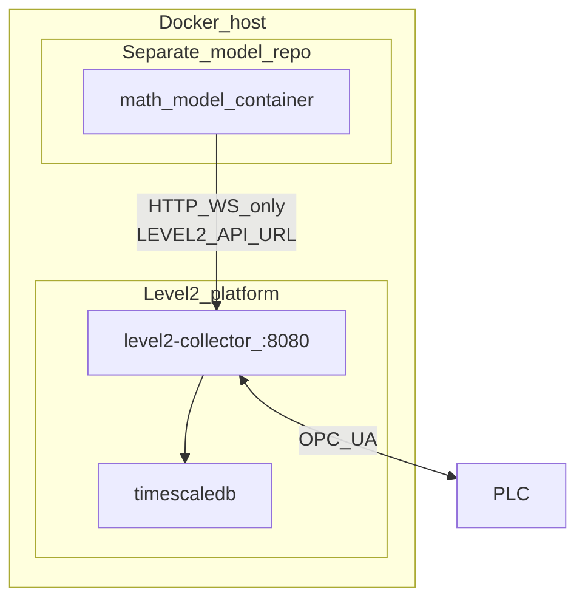

# Level2 + math model integration

Level2 is the **stable plant platform** (OPC UA gateway, Timescale historian, Admin UI, REST/WS API).  
A **math / control model** is a **separate project and container** that talks to Level2 **only** over HTTP/WebSocket. It never opens OPC UA and never mounts the Timescale volume.

**Canonical API contract:** [`api/openapi.yaml`](../api/openapi.yaml) — served at `GET /api/v1/openapi.yaml` and browsable at **`http://<host>:8080/docs`** (Swagger UI).

Related: [external-client-api.md](external-client-api.md), [opc-write-mode.md](opc-write-mode.md).

---

## Architecture

| Layer | Responsibility | Lifecycle |
|-------|----------------|-----------|
| **Level2** | OPC credentials, NodeIds, poll/reconnect, coerce, Live, historian, write gate, audit/diag, Admin UI | One platform compose (`deploy/platform`) |
| **Math model** | Process model, control loop, mapping own names → `tag_id`, quality/fail-safe policy | **Separate GitHub repo / image**; swapped per technology |
| **PLC** | Authoritative process values and AccessLevel | Plant |

**Rules**

- Model env: `LEVEL2_API_URL` (e.g. `http://level2-collector:8080` on the lab Docker network).
- Model implements against **OpenAPI** (this repo’s `api/openapi.yaml` or live `/api/v1/openapi.yaml`).
- Do **not** put model source under this Level2 repo; do **not** bake the model into the collector image.

---

## Closed loop via API

1. `GET /readyz` (and optionally `GET /api/v1/devices`) until connected.
2. Inputs: `GET /api/v1/ws/stream` (filter `tag_id` client-side) and/or `GET /api/v1/tags`.
3. Compute setpoints / commands from technology rules.
4. Outputs: `PUT /api/v1/tags/{tag_id}/value` with JSON body `{ "value": …, "device_id": "…" }`.
5. Confirm via next Live/WS sample; **no silent retry** of writes after ambiguous timeouts.

Bind only on stable **`tag_id`** (+ `device_id` when needed). Level2 owns the DB write list / project; the model keeps its own Inputs/Outputs → `tag_id` mapping (versioned with the technology).

Sample contract: `time`, `tag_id`, `value_num` | `value_text` | `value_bool`, `quality` (`0` = Good). On `quality != 0`, the model applies its own fail-safe (skip write / hold last SP / etc.).

---

## Write gate (required for outputs)

| Setting | Default | Effect |
|---------|---------|--------|
| `opc_write_enabled` (YAML) / **`LEVEL2_OPC_WRITE_ENABLED`** | **`false`** | When off, PUT returns **403** |

Enable only on intentional lab/plant setups. Diagnostics category: `opc_write`.

---

## Phases

| Phase | Platform | Model |
|-------|----------|--------|
| **0** | Reads, WS, history, OpenAPI/Swagger | Dry-run: mapping + HTTP/WS client; log intended writes without PUT |
| **1** (this delivery) | OPC write MVP + OpenAPI + `/docs` | PUT outputs when gate on |
| **2** | Batch write, tag `writable`, WS filter by `tag_id` | First production model container on lab network |
| **3** | API token, write-then-verify, roles | Hardened plant deployment |

Phase 2–3 items are **not** in this change; they are planned only.

---

## Safety notes

1. Platform: keep write **off** until lab-proven; anyone who can reach `:8080` can write when the gate is on (no HTTP auth yet).
2. Model: do not write when Level2 is unready or input quality is bad unless a documented fail-safe applies.
3. Separate setpoints vs pulse/edge commands in the model mapping.
4. Isolate model on Docker network; do not publish it unless needed.
5. Model must not mount OPC credentials or the Level2 DB volume.

---

## Quick links

| Resource | URL / path |
|----------|------------|
| Swagger UI | `http://<host>:8080/docs` |
| OpenAPI YAML | `http://<host>:8080/api/v1/openapi.yaml` or [`api/openapi.yaml`](../api/openapi.yaml) |
| External client guide | [external-client-api.md](external-client-api.md) |
| OPC write design | [opc-write-mode.md](opc-write-mode.md) |
