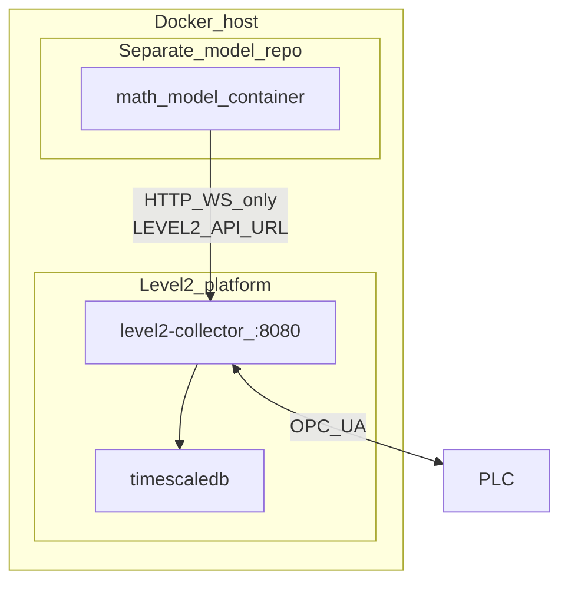

# Level2 + math model integration

Level2 is the **stable plant platform** (OPC UA gateway, Timescale historian, Admin UI, REST/WS API).  
A **math / control model** is a **separate GitHub project** (and usually a separate container). It talks to Level2 **only** over HTTP/WebSocket (`LEVEL2_API_URL`). It never opens OPC UA, never mounts the Timescale volume, and **must not** live as source under this Level2 repository.

| Repo | Role |
|------|------|
| **Level2** (this repo) | Platform + **API contract** ([`api/openapi.yaml`](../api/openapi.yaml)) + Admin UI |
| **Math model** (other repo) | Process/control logic; HTTP/WS client against Level2 |

**Canonical API contract:** OpenAPI **v1.2.1** — [`api/openapi.yaml`](../api/openapi.yaml), also `GET /api/v1/openapi.yaml` and Swagger UI at **`http://<host>:8080/docs`**. The spec covers the **full** collector surface (integration + admin). When narrative docs disagree with OpenAPI, **OpenAPI wins**.

Related: [external-client-api.md](external-client-api.md), [opc-write-mode.md](opc-write-mode.md).

---

## Architecture

| Layer | Responsibility | Lifecycle |
|-------|----------------|-----------|
| **Level2** | OPC credentials, NodeIds, poll/reconnect, coerce, Live, historian, write gate, audit/diag, Admin UI | One platform compose (`deploy/platform`) |
| **Math model** | Process model, control loop, mapping own names → `tag_id`, quality/fail-safe policy | **Separate GitHub repo / image**; swapped per technology |
| **PLC** | Authoritative process values and AccessLevel | Plant |

**Rules**

- Model env: `LEVEL2_API_URL` (e.g. `http://level2-collector:8080` on the lab Docker network).
- Model implements against **OpenAPI** (this repo’s `api/openapi.yaml` or live `/api/v1/openapi.yaml` / `/docs`).
- Do **not** put model source under this Level2 repo; do **not** bake the model into the collector image; do **not** expect a model skeleton here — only the platform contract.

---

## Closed loop via API

1. `GET /readyz` (and optionally `GET /api/v1/devices`) until connected.
2. Inputs: `GET /api/v1/ws/stream?tag_id=…` (server-side filter) and/or `GET /api/v1/tags`.
3. Compute setpoints / commands from technology rules.
4. Outputs: `PUT /api/v1/tags/{tag_id}/value` or batch `POST /api/v1/tags/values` (tags must be `writable: true`). Prefer `"verify": true` (or `?verify=true`) when setpoints must be confirmed.
5. Confirm via verify readback and/or next Live/WS sample; **no silent retry** of writes after ambiguous timeouts.

Bind only on stable **`tag_id`** (+ `device_id` when needed). Level2 owns the DB write list / project; the model keeps its own Inputs/Outputs → `tag_id` mapping (versioned with the technology).

Sample contract: `time`, `tag_id`, `value_num` | `value_text` | `value_bool`, `quality` (`0` = Good). On `quality != 0`, the model applies its own fail-safe (skip write / hold last SP / etc.).

---

## Write gates (required for outputs)

| Setting | Default | Effect |
|---------|---------|--------|
| `opc_write_enabled` / **`LEVEL2_OPC_WRITE_ENABLED`** | **`false`** | Master kill switch; when off, write APIs return **403** |
| Tag **`writable`** | **`false`** | Per-tag allow-list; write returns **403** when false. Set via tag CRUD / project.xlsx column / YAML |
| **`LEVEL2_API_TOKEN_WRITE`** | empty | When set (or legacy shared set): `PUT/POST …/value(s)` + WS require write/admin/legacy token → **401** if missing/wrong |
| **`LEVEL2_API_TOKEN_ADMIN`** | empty | Wipe, capacity-policy, project import, device/tag config. Write token on these → **403** |
| **`LEVEL2_API_TOKEN`** / `api_token` | empty (auth off) | Legacy shared: both write and admin roles. Prefer Write + Admin for the model vs ops split |

Prefer env for tokens (`LEVEL2_API_TOKEN_WRITE` / `_ADMIN` / legacy); rewritten `config.yaml` does not persist token fields. Existing tags without `writable` load as **false** — set `writable: true` on outputs (or backfill via project import / API).

Give the external math-model only **`LEVEL2_API_TOKEN_WRITE`** so it cannot wipe samples or change collector config.

Enable write only on intentional lab/plant setups. Diagnostics category: `opc_write`.

---

## Phases

| Phase | Platform | Model |
|-------|----------|--------|
| **0** | Reads, WS, history, OpenAPI/Swagger | Dry-run: mapping + HTTP/WS client; log intended writes without PUT |
| **1** | OPC write MVP + OpenAPI + `/docs` | PUT outputs when gate on |
| **2–3** (delivered) | Batch write, tag `writable`, WS filter, API token, **write-then-verify**, full OpenAPI surface | Production-minded model container on lab network |

Still deferred (not in Level2 platform scope here): math-model implementation stays in its own repo. Split write/admin tokens: **delivered** (SCRUM-15). TypeMismatch auto-retry: **delivered** (SCRUM-16).

---

## Safety notes

1. Platform: keep write **off** until lab-proven; when on, use token + `writable` so the model cannot touch arbitrary tags.
2. Model: do not write when Level2 is unready or input quality is bad unless a documented fail-safe applies.
3. Separate setpoints vs pulse/edge commands in the model mapping.
4. Isolate model on Docker network; do not publish it unless needed.
5. Model must not mount OPC credentials or the Level2 DB volume.

---

## Quick links

| Resource | URL / path |
|----------|------------|
| Swagger UI | `http://<host>:8080/docs` |
| OpenAPI YAML | `http://<host>:8080/api/v1/openapi.yaml` or [`api/openapi.yaml`](../api/openapi.yaml) **v1.3.0** |
| External client guide | [external-client-api.md](external-client-api.md) |
| OPC write design | [opc-write-mode.md](opc-write-mode.md) |
