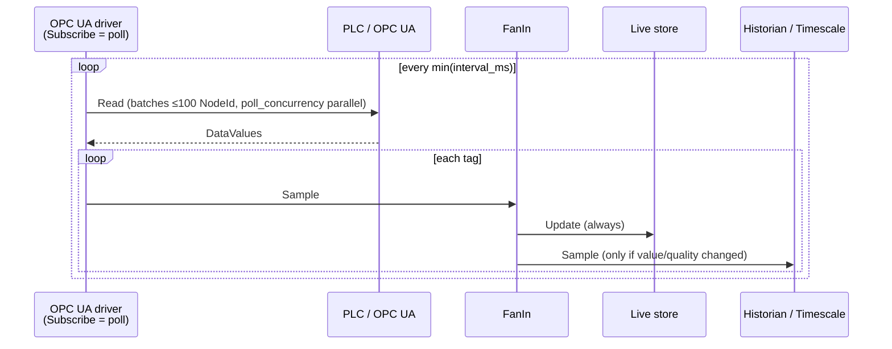
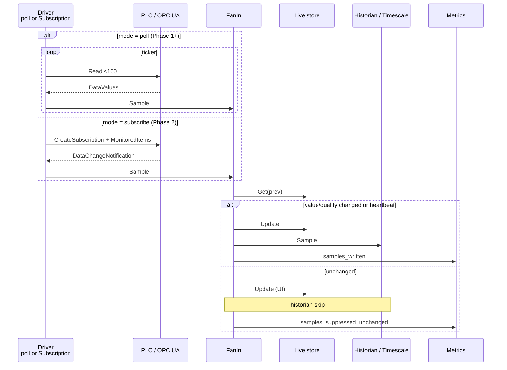

# OPC UA: poll vs subscribe (on-change) mode

Design for writing to Timescale **only when the value actually changes**, not on every poll tick. This document covers current behavior, the target model on `gopcua` Subscription / MonitoredItems, config, Siemens limits, fallback, and phased rollout.

**Status:** Phase 1 done (suppress unchanged on the poll path). Full OPC Subscription (Phase 2) is **not** implemented.

Related (orthogonal): writing values **to the PLC** — see [opc-write-mode.md](opc-write-mode.md). Datatype expand / Sync from OPC — [opc-datatype-sync.md](opc-datatype-sync.md). Those paths are separate from historian “DB write” / on-change suppress.

---

## 1. Current behavior (as-is)

Source of truth: `internal/driver/opcua/driver.go` — the `Subscribe` method is **implemented today as periodic poll**.

1. The collector gathers the device's enabled leaf tags.
2. It takes the **minimum** `interval_ms` among tags (one ticker per device).
3. On each tick `pollOnce` → `pollBatch`: OPC UA **Read** in batches of **`maxNodesPerRead = 100`** (guard against `BadTooManyOperations` on Siemens and others). Up to **`poll_concurrency`** parallel Read batches (device setting, default **4**, clamp **1–16**; errgroup) so ~3k tags (~32–33 batches) are not fully sequential wall-clock.
4. Every successful (and bad) sample goes to the `out` channel.
5. `api.FanIn` for **every** sample:
   - updates the Live store (`live.Update`);
   - sends to the WebSocket Hub;
   - forwards into the historian buffer **only when value or quality differ from the previous Live sample** (Phase 1); identical payloads increment `samples_suppressed_unchanged`.
6. The UI (**DB write list** / `TagTreeTable`) shows per-tag `interval_ms` (e.g. `1000`) and the average wall-clock poll interval.

Result (before Phase 1): with a static process, Timescale grew proportional to `tags × (1000/interval_ms)` even when values did not change. After Phase 1, unchanged polls still refresh Live/WS but skip Timescale.



---

## 2. Target model (to-be)

Two data-acquisition modes; historian writes are **on-change** (with optional heartbeat).

### 2.1. OPC UA Subscription / MonitoredItems (`gopcua`)

Instead of client-side ticker + Read:

| Parameter | Meaning | How we map it in Level2 |
|-----------|---------|-------------------------|
| **PublishingInterval** | How often the server sends NotificationMessage to the client | At subscription / device level (or tag group) |
| **SamplingInterval** | How often the server samples the node in a MonitoredItem | Tag `interval_ms` as a **hint** for subscribe mode |
| **Deadband** (Absolute / Percent / None) | Server-side filtering of “noisy” analogs | Optional later; Phase 1–2 default **None** (compare on the collector side) |
| **QueueSize / DiscardOldest** | Notification queue under bursts | Small defaults (e.g. 1–10) |

Important distinctions:

- **SamplingInterval** ≠ DB write period.
- **Deadband** is server-side filtering; **compare against Live** is client-side. For Phase 1–2 we rely on client-side comparison (predictable for bool/int/string and independent of PLC deadband support).

Library: [`github.com/gopcua/opcua`](https://github.com/gopcua/opcua) — `Subscription`, `Monitor`, callbacks / notification channel. Current `Driver.Subscribe` stays the `core.Driver` contract; inside: poll | real subscription branch.

### 2.2. Modes: poll (legacy) vs subscribe (on-change)

Mode is set **per tag** (preferred), with an optional device-level default:

| `mode` | Acquisition from OPC | When sample reaches FanIn |
|--------|----------------------|---------------------------|
| `poll` | Periodic Read (as today), batches ≤100 | Every tick |
| `subscribe` | MonitoredItems / Subscription | On server notification (change / status) |

Mixed set on one device: poll tags stay on ticker+Read; subscribe tags go into one or more OPC Subscriptions. If mixing on one client is impossible — two internal goroutines per device.

### 2.3. When to write to Timescale

Unified policy **after** a sample is received (for both poll Phase 1 and subscribe Phase 2):

1. Load previous sample from the **Live store** by `tag_id`.
2. Compare payload: `ValueNum` / `ValueText` / `ValueBool` + `Quality` (time does **not** participate in equality).
3. **Always** update Live + WS (UI stays “live”).
4. To historian:
   - if value/quality **changed** → write;
   - if **equal** → **do not** write (`samples_suppressed_unchanged++`);
   - **optional heartbeat**: every `N` minutes still write an unchanged sample (series freshness / gap detection). Default: off, or 15–60 min (collector / device config).

The first sample after start / reconnect is always written (no previous).

Where to implement comparison: **`FanIn`** (or a thin layer before `out <- s` into historian), so both poll and future subscribe share one policy.



---

## 3. Configuration

### 3.1. Tag fields

```yaml
tags:
  - id: Motor1.Speed
    node_id: "ns=4;i=4208"
    datatype: float64
    enabled: true
    mode: subscribe          # poll | subscribe; default: poll
    interval_ms: 1000        # poll: Read-group period; subscribe: SamplingInterval hint
```

| Field | `poll` | `subscribe` |
|-------|--------|-------------|
| `mode` | legacy periodic Read | OPC MonitoredItem |
| `interval_ms` | ticker period (today — min per device) | hint → `SamplingInterval` (ms); `0` / omit → server default |
| `enabled` | unchanged | unchanged |

Optional later (not Phase 1):

- `heartbeat_ms` / device `historian_heartbeat_ms`
- `deadband_type` / `deadband_value`

### 3.2. Core stub

In `internal/core`, introduce type `PollMode` (`poll` | `subscribe`) and optional field `Tag.Mode`. Empty value is treated as `poll`.

### 3.3. Persist / API / XLSX

- YAML project + REST tag CRUD: `mode` field.
- Import/Export XLSX: `mode` column (default `poll` if missing).
- Backward compatible: old configs without `mode` = poll.

---

## 4. Siemens limits and subscription batching

Siemens S7-1500 OPC UA (and many servers):

- **MaxMonitoredItems** / operation limit on CreateMonitoredItems.
- Error **`BadTooManyMonitoredItems`** (or related status codes) when exceeded.
- Same as Read: already have `maxNodesPerRead = 100`.

**Phase 2 strategy:**

1. Discover / hardcode a conservative default (e.g. chunks of **50–100** MonitoredItems per Create; PublishingInterval aligned with the group).
2. On `BadTooManyMonitoredItems` — shrink chunk size and retry; on persistent failure — **fallback to poll** for remaining tags.
3. Multiple Subscriptions per device if one cannot hold all items (items-per-subscription limit).
4. Log via `diag` + metrics for active MonitoredItems / fallback tags.

Keep limit numbers in constants / config (`max_monitored_items_per_create`), do not hardcode “magic” values in a single place only.

---

## 5. Fallback: Subscribe → poll

If CreateSubscription / CreateMonitoredItems / runtime subscription fails:

1. Write a warning to diagnostics (`OPCRead` / separate code).
2. Mark affected tags (or the whole device) as running in **poll fallback**.
3. Continue collection via the existing `pollOnce` path.
4. UI: optionally show effective mode (`subscribe` requested → `poll` effective) — Phase 2+.
5. Do not crash the whole collector because of one device.

Reconnect after channel drop: retry subscribe; on repeated failures — stay on poll with backoff.

---

## 6. Metrics

Existing:

- `level2_samples_written_total` — successful historian write.

Add:

| Metric | Type | Meaning |
|--------|------|---------|
| `level2_samples_suppressed_unchanged_total` | Counter | Sample not sent to historian because value/quality == Live |
| (opt.) `level2_samples_heartbeat_written_total` | Counter | Writes only due to heartbeat |
| (opt.) `level2_opc_monitored_items` | Gauge | Active MonitoredItems |
| (opt.) `level2_opc_subscribe_fallback_tags` | Gauge | Tags in poll fallback |

Meaning of the **written vs suppressed** pair: estimate disk savings and verify that suppress does not “eat” real changes.

---

## 7. UI (DB write list)

File: `web/src/components/TagTreeTable.jsx` (+ `DbWriteListPage`, `tagTree.js`).

- Next to `interval_ms` — **`<select>` Mode**: `poll` | `subscribe`.
- Label / tooltip:
  - poll: “Read period”;
  - subscribe: “SamplingInterval hint; write to DB on change”.
- Default when adding a tag: `poll` (safe legacy).
- After Phase 1 suppress: even with `poll`, disk is not filled with unchanged points; Mode affects the **acquisition path** (Phase 2).

---

## 8. Rollout phases

### Phase 1 — suppress unchanged on the poll path (no OPC Subscription)

**Status:** done (FanIn compares Live payload; historian skipped when equal).

**Goal:** immediately reduce Timescale volume with the current Read-poll.

1. In `FanIn` (or adjacent filter): compare with Live → skip historian if equal; Live/WS always.
2. Metrics `samples_written` / `samples_suppressed_unchanged`.
3. Optional: heartbeat.
4. (Opt.) UI Mode select + `mode` field in config — persist only for now; driver ignores and always polls.
5. Stub `PollMode` in `core` — readiness for Phase 2.

**Lab wipe interaction:** `POST /api/v1/database/wipe-samples` truncates Timescale only. Without a Live reset, the next identical poll would still **suppress** (Live still holds the last payload) and the historian would stay empty until a value/quality change. After a successful wipe the API therefore: (1) snapshots Live, (2) **clears Live**, (3) **WriteBatch**s that snapshot as fresh samples (`reseeded` / `live_cleared` in the response). Charts refill immediately; the next poll is treated as a first sample (no suppress against stale Live).

**Out of scope:** CreateSubscription, MonitoredItems.

### Phase 2 — real OPC Subscription

1. Branch in `opcua.Driver.Subscribe`: tags with `mode=subscribe` → Subscription; `mode=poll` → ticker+Read.
2. CreateMonitoredItems batches, handle `BadTooManyMonitoredItems`.
3. Fallback to poll.
4. UI Mode actually switches the path; effective mode on fallback.
5. MonitoredItems / fallback metrics.

### Phase 3 (later)

- Server-side deadband.
- Per-tag Publishing groups.
- Device-level default mode.
- Fine-tuning QueueSize / subscription keepalive.

---

## 9. Risks and mitigations

| Risk | Mitigation |
|------|------------|
| Float “jitter” → still many writes | Deadband (Phase 3) or comparison rounding (carefully, opt-in) |
| UI “freezes” if Live is not written | Live always updates |
| Missing rare changes on bad suppress | Compare quality; first sample always write; equality tests |
| Empty historian after lab wipe | Wipe clears Live + re-seeds Timescale from Live snapshot (see Phase 1 note) |
| Siemens rejects a large subscription | Chunks + poll fallback |
| Mixing min(interval_ms) for the poll group | Phase 2: poll group only from poll tags; subscribe does not affect ticker |

---

## 10. Test plan (short)

**Phase 1**

- [x] Static mock/demo tag: N ticks → 1 historian write (+ optional heartbeats).
- [x] Value change → new write.
- [x] Quality-only change → write.
- [x] Metrics: suppressed grows, written does not on equal.
- [x] Live/WS update on every sample.
- [x] After wipe-samples: Live cleared + snapshot re-seeded; identical post-wipe sample is not suppressed.

**Phase 2**

- [ ] Subscribe path on lab PLC / mock server.
- [ ] Exceeding item limit → chunk / fallback.
- [ ] Subscription drop → reconnect / poll fallback without losing the collector process.

---

## 11. Code references

| Component | Path |
|-----------|------|
| Poll-as-Subscribe | `internal/driver/opcua/driver.go` (`Subscribe`, `pollOnce`, `maxNodesPerRead`) + `poll_batch.go`; device `poll_concurrency` in `core.Device` / Servers UI |
| FanIn | `internal/api/api.go` |
| Live store | `internal/store/live.go` |
| Tag / Driver API | `internal/core/types.go` |
| Metrics | `internal/metrics/metrics.go` |
| DB write list UI | `web/src/pages/DbWriteListPage.jsx`, `web/src/components/TagTreeTable.jsx` |
| Architecture (as-is) | [README.md](../README.md) |

---

## 12. Poll performance note (large tag sets)

With ~3200 leaf tags and `maxNodesPerRead = 100`, a **fully sequential** poll is ~32 Read round-trips. On a lab S7-1500 that often yields **wall-clock cycle ≈ 6 s**, so Overview `poll_avg_ms` stays ~6000 even when `interval_ms = 1000` (ticker cannot go faster than one full `pollOnce`).

**Mitigation (current):** parallelize Read batches with per-device **`poll_concurrency`** (default **4**, clamp **1–16**; Servers → Edit → **Parallel reads**, or YAML `devices[].poll_concurrency`). Same batch size 100 (Siemens-safe); with concurrency 4, ~8 RTT waves instead of ~32. Helpers: `core.NormalizePollConcurrency`, `chunkRanges` / `pollReadConcurrency`. Changing the setting recreates the device driver.

**Not done here:** raising NodesToRead above 100 (risky `BadTooManyOperations`); interval-bucket workers (helps only when tags have mixed intervals); Phase 2 OPC Subscription (still the long-term path for true on-change acquisition and lower client Read load).
