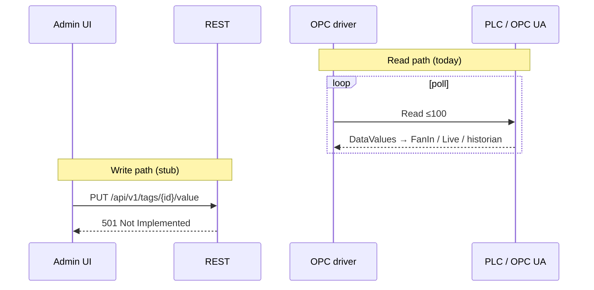

# OPC UA: writing tag values to the PLC

Design for **writing process values** from Level2 into OPC UA nodes (Siemens S7-1500 and similar). Distinct from [historian on-change / subscription mode](opc-subscription-mode.md) (“DB write”) and from UI labels such as “Write to DB”, which mean *add tag to the poll/historian list*. Datatype Sync / expand: [opc-datatype-sync.md](opc-datatype-sync.md).

External programs (any language) should call the same REST write once it exists — gateway role, read paths, and client contract: [external-client-api.md](external-client-api.md).

**Status:** Phase 2–3 hardening implemented (batch write, API token, tag `writable`, WS filter). REST write when `opc_write_enabled` / `LEVEL2_OPC_WRITE_ENABLED` is true (default **off** → **403**). OpenAPI: [`api/openapi.yaml`](../api/openapi.yaml), Swagger `/docs`.

---

## 1. Current behavior (as-is)

| Area | Today |
|------|--------|
| OPC driver | `internal/driver/opcua/driver.go` — Connect + periodic **Read** (`Subscribe` = poll) + **`WriteValue`**. |
| Library | [`github.com/gopcua/opcua` v0.7.1](https://github.com/gopcua/opcua) — `Client.Write(ctx, *ua.WriteRequest)`. |
| REST | `PUT /api/v1/tags/{id}/value` and batch `POST /api/v1/tags/values` — gated by `opc_write_enabled` (default off → **403**). |
| Tag model | `id`, `node_id`, `path`, `datatype`, `enabled`, `interval_ms`, **`writable`** (default **false**), optional `mode` (`poll` \| `subscribe`). |
| Live / FanIn | Poll → Live + WS always; Timescale only on value/quality change ([Phase 1 suppress](opc-subscription-mode.md)). |
| Auth | Optional shared **`LEVEL2_API_TOKEN`** on mutating `/api/v1/*` + WS (empty = open lab). |
| Diagnostics | Categories `opc_read`, `opc_write`, `db_write`. |
| UI | **DB write list** shows live value as read-only text. Writable toggle in Admin UI is a follow-up. |



---

## 2. Goals / non-goals

### Goals

1. Write a single scalar value to a configured monitored tag’s OPC node (`AttributeIDValue`).
2. Coerce JSON / UI input to the tag’s configured `datatype` (and a Variant type Siemens will accept).
3. Surface success / OPC status clearly (HTTP + diagnostics + optional metrics).
4. Keep the existing poll/subscribe acquisition path intact; writing must not stall or crash the collector.
5. Provide a safe-enough UI flow for lab use (confirm dialog; optional feature flag).
6. Define how a write interacts with Phase 1 suppress and future subscriptions (readback / Live).

### Non-goals (MVP and near-term)

- Writing non-Value attributes (DisplayName, Description, …).
- Writing structures / ExtensionObjects / arrays / IndexRange.
- OPC Method Call / Program control.
- Full RBAC / multi-user auth (lab stays open until a later security phase).
- Writing arbitrary `node_id` that is **not** in the DB write list (optional later escape hatch).
- Soft PLC / recipe engines / transactional multi-tag recipes with rollback.
- Changing Siemens AccessLevel from Level2 (server-side ACLs stay authoritative).

---

## 3. Target model (to-be)

```mermaid
sequenceDiagram
  participant UI as Admin UI
  participant API as REST
  participant Hub as runtime.Hub
  participant Drv as opcua.Driver
  participant PLC as PLC
  participant Live as Live store
  participant Fan as FanIn / poll

  UI->>API: PUT /api/v1/tags/{id}/value
  API->>API: resolve tag + device, coerce datatype
  API->>Hub: Driver for device_id
  API->>Drv: Write(tag, variant)  (share client mu with Read)
  Drv->>PLC: WriteRequest (1 NodeId)
  PLC-->>Drv: StatusCode
  alt StatusOK
    Drv-->>API: ok
    opt optimistic Live (MVP choice — see §7)
      API->>Live: Update(written sample)
      API->>API: WS broadcast
    end
    API-->>UI: 200 + written / status
    Note over Fan,Live: Next poll/subscribe sample confirms; FanIn historian on change
  else BadUserAccessDenied / TypeMismatch / …
    Drv-->>API: error + status
    API->>API: diag opc_write
    API-->>UI: 4xx/502 + status text
  end
```

### 3.1. Driver Write (`gopcua`)

Add an explicit write capability on the OPC driver (preferred: small interface, not bloating `core.Driver` Subscribe contract):

```go
// optional capability — same pattern as core.Browser
type Writer interface {
    WriteValue(ctx context.Context, tag core.Tag, v ua.Variant /* or any */) error
}
```

Implementation sketch in `opcua.Driver`:

1. Lock the same `mu` / client used by `pollBatch` (serialize Write with Read on one session — see §9).
2. Resolve `tag.NodeID` via existing `toUANodeID` / namespace URI cache.
3. Build `ua.WriteRequest` with one `ua.WriteValue`:
   - `AttributeID: ua.AttributeIDValue`
   - `Value: &ua.DataValue{EncodingMask: ua.DataValueValue, Value: variant}`
4. `resp, err := client.Write(ctx, req)`.
5. Require `resp.Results[0] == ua.StatusOK`; map other status codes to typed errors.

Reuse connect/reconnect already used by poll; do **not** open a second client per write unless we later prove session contention requires it.

### 3.2. Datatype coercion

Input is JSON (REST) or string from an `<input>` (UI). Coerce using **configured** `tag.datatype` (same enum as read path: `bool` | `int64` | `uint` | `float64` | `string` | `datetime`).

| `datatype` | Accept from JSON | Variant Go type (MVP recommendation) | Notes |
|------------|------------------|--------------------------------------|--------|
| `bool` | `true`/`false`, `"true"`/`"false"`, `0`/`1` | `bool` | |
| `int64` | number / numeric string | `int64` (or narrower if OPC DataType known — Phase 2) | Siemens often expects Int16/Int32 — see risks |
| `uint` | number / numeric string | `uint32` or `uint64` | Prefer matching OPC DataType when known |
| `float64` | number / numeric string | `float64` (fallback `float32` on TypeMismatch retry — Phase 2) | Classic Siemens REAL = float32 |
| `string` | string (truncate via existing `TruncateString`) | `string` | |
| `datetime` | RFC3339 / RFC3339Nano string | `time.Time` / OPC DateTime | Reject empty unless we define “clear” semantics |

Rules:

- Reject wrong JSON shape with **400** before touching OPC.
- Prefer reading OPC `DataType` attribute (already have `readOPCDataType`) for **Variant wire type** when available; fall back to platform `datatype` mapping.
- Phase 2: on `BadTypeMismatch`, one automatic retry with alternate width (e.g. float64→float32, int64→int32) logged in diag.

Inverse of `mapDataValue` / `asFloat64` helpers should live in something like `internal/driver/opcua/write_value.go` with unit tests mirroring `value_test.go`.

### 3.3. Tag / config stubs (optional fields)

Not required for MVP if every monitored tag is writable in lab. Recommended for Phase 2:

```yaml
tags:
  - id: Motor1.SpeedSP
    node_id: "ns=4;i=4209"
    datatype: float64
    enabled: true
    writable: true          # default false in production-minded configs; lab default TBD
```

| Field | Meaning |
|-------|---------|
| `writable` | Level2-side allow-list for Write API / UI. Default **false** (new tags and YAML omitting the field). Independent of Siemens AccessLevel (server can still deny). Backfill: set via PUT tag / project.xlsx `writable` column / YAML. |

Device-level kill switch (env / YAML):

| Setting | Meaning |
|---------|---------|
| `LEVEL2_OPC_WRITE_ENABLED` / `opc_write_enabled` | Global gate. Default **`false`**. When false → API returns **403** (not 501). |
| `LEVEL2_API_TOKEN` / `api_token` | Optional shared token. Empty = auth disabled. When set → mutating `/api/v1/*` + WS require Bearer / `X-API-Token` / `X-API-Key` / `?token=` → **401**. Prefer env; rewritten config strips `api_token` from YAML. |

---

## 4. API sketch

Keep the existing route; replace the stub.

### 4.1. Single write (MVP)

```http
PUT /api/v1/tags/{tag_id}/value
Content-Type: application/json

{
  "value": 42.5,
  "device_id": "s7_1500"   // optional if tag_id unique across devices
}
```

Alternate body forms (accept one):

```json
{ "value": true }
{ "value": "hello" }
{ "value": "2026-08-06T12:00:00Z" }
{ "value_num": 42.5 }
{ "value_bool": true }
{ "value_text": "hello" }
```

Prefer a single `value` field for UI simplicity; typed fields are optional aliases matching Live sample DTO.

**Success 200:**

```json
{
  "tag_id": "Motor1.SpeedSP",
  "device_id": "s7_1500",
  "node_id": "ns=4;i=4209",
  "status": "Good",
  "written": { "value_num": 42.5 },
  "verified": false
}
```

**Errors:**

| HTTP | When |
|------|------|
| 400 | Coercion / missing value / unknown datatype |
| 403 | Global write disabled or tag `writable=false` |
| 401 | API token configured and missing/wrong |
| 404 | Unknown tag_id (or ambiguous without `device_id`) |
| 409 | Device not connected |
| 502 | OPC transport / StatusCode not Good (body includes status string, e.g. `BadUserAccessDenied`) |
| 501 | Removed once MVP ships (tests updated) |

### 4.2. Write by node_id (optional Phase 2)

```http
PUT /api/v1/devices/{device_id}/nodes/value
{ "node_id": "ns=4;i=4209", "datatype": "float64", "value": 1.0 }
```

Only if we need Address Space ad-hoc write without adding a tag. Higher risk — gate behind the same global flag + confirm UI.

### 4.3. Batch write

```http
POST /api/v1/tags/values
{
  "writes": [
    { "tag_id": "A", "value": 1 },
    { "tag_id": "B", "value": true }
  ]
}
```

- Max **100** items per request.
- **Partial success:** HTTP **200** when the batch body parses; each item has `ok`, optional `error` / `http_status`, and `written` on success.
- Same gates as single PUT: global enable, API token (if configured), per-tag `writable`, coerce, OPC Write, diag.

### 4.4. Write-then-verify (Phase 3)

Query param or body flag: `"verify": true`, optional `"verify_timeout_ms": 2000`.

After StatusOK Write:

1. OPC **Read** same NodeId (or wait for next Live sample matching expected value within timeout).
2. Set `"verified": true` only if readback matches (with float epsilon policy).
3. On mismatch → **409** or **502** with both written and observed values (Write already applied — document as non-transactional).

---

## 5. Safety & auth

Even while the lab API stays open:

1. **Global enable flag** (default off in code; on in lab `.env` when ready).
2. **Confirm dialog** in UI before every write (show tag id, node id, old live value, new value).
3. **Diagnostics**: new category `opc_write` — log every attempt (info on success with tag/value summary; warn/error on deny/mismatch). Mirror pattern of `diag.OPCRead`.
4. **Metrics** (optional MVP, recommended Phase 2):
   - `level2_opc_writes_total{result="ok|denied|error"}`
5. **Do not** invent silent retries that rewrite after success.
6. **Permissions (later):** when HTTP auth lands, map role → write; until then document that anyone who can reach `:8080` can write if the flag is on.
7. Siemens **UserAccessLevel** remains the hard gate — Level2 `writable` is advisory / UX only.

Quality: a successful Write does not invent historian quality; Live optimistic update uses `QualityGood`. Failed write leaves Live unchanged (unless a concurrent poll updates it).

---

## 6. UI flow

Primary surface: **DB write list** (`DbWriteListPage` / `TagTreeTable`) — operators already look at live values there.

MVP UX:

1. Click the live value cell (or a small “Set…” button next to it) → inline editor or modal.
2. Confirm: “Write **{new}** to **{tag_id}** (`{node_id}`) on **{device}**? Current live: {old}.”
3. `PUT /api/v1/tags/{id}/value` with `device_id`.
4. Toast / row flash: OK or OPC status text; refresh live (poll already every 3s; optional immediate GET).

**Monitor / Address Space:** keep “Write to DB” wording as *add to list*. Optional later: “Write value…” on a selected leaf that is already monitored (deep link into the same editor). Avoid inventing writes for non-monitored nodes in MVP.

Disable Set controls when:

- global write flag off;
- device disconnected;
- tag `writable === false` (once field exists);
- sim browser mode (`LEVEL2_SIM_BROWSER=1`) unless we add a sim Writer stub.

---

## 7. Interaction with Phase 1 suppress & subscriptions

| Concern | Behavior |
|---------|----------|
| Historian after write | Do **not** insert a synthetic historian row from the Write API itself (keeps one writer path). Rely on next poll/subscribe sample → FanIn: if value/quality ≠ previous Live → Timescale write. |
| Optimistic Live | **MVP recommendation:** update Live + WS immediately with the written value so UI feels responsive. FanIn suppress then compares the next OPC sample to that optimistic value — if PLC accepted the write, sample matches → **suppressed** (correct). If PLC ignored / delayed, sample differs → historian gets the real process value. |
| Conservative alternative | No optimistic Live; wait for poll readback. Safer audit trail, slower UI — optional via `"optimistic": false`. |
| Concurrent poll | Write and Read share client lock → brief poll jitter; acceptable. Avoid holding lock across verify Read+sleep. |
| Subscribe (Phase 2 of [subscription doc](opc-subscription-mode.md)) | DataChange should deliver the new value; same FanIn policy. If server does not notify on self-write, poll fallback or explicit verify Read still applies. |
| Bad quality before write | Still allow write if connected; document that we do not require Good live quality to set a SP. |

---

## 8. Phased plan

### Phase 0 — design (this doc)

- [x] Document goals, API, driver, coercion, safety, UI, risks.
- [ ] Cross-link from README / platform API table (status remains 501 until Phase 1 code).

### Phase 1 — MVP single write

1. Global `opc_write_enabled` gate (default false).
2. `opcua.Driver.WriteValue` + coercion helpers + unit tests (no PLC required for coercion).
3. Resolve `tag_id` → device via config; call Writer through `runtime.Hub`.
4. Implement `PUT /api/v1/tags/{id}/value`; update `api_test.go` (mock Writer or connected stub).
5. `diag` category `opc_write`.
6. UI: confirm + set value on DB write list row.
7. Lab verify on Siemens writable node (bool or REAL setpoint).

**Out of scope:** batch, verify flag, `writable` field, write-by-node_id.

### Phase 2 — hardening

1. Tag `writable` + XLSX column; UI respects it.
2. OPC DataType-aware Variant + TypeMismatch retry.
3. Batch `POST /api/v1/tags/values` with chunking (`maxNodesPerWrite`).
4. Metrics counters; Diagnostics page filter for `opc_write`.
5. Optional Address Space write for monitored leaves only.

### Phase 3 — write-then-verify & productization

1. Verify Read / wait-for-Live match + epsilon.
2. HTTP auth / role for writes.
3. Audit persistence beyond ring buffer (if required).
4. Sim driver Writer for CI without PLC.

---

## 9. Risks and mitigations

| Risk | Mitigation |
|------|------------|
| `BadUserAccessDenied` / not writable on Siemens | Clear 502 + status; check PLC user rights / AccessLevel; Level2 `writable` only soft-gate |
| `BadTypeMismatch` (float64 vs REAL float32, Int64 vs Int16) | Prefer OPC DataType for Variant; retry narrower types; document lab type sync (`tags/sync`) |
| `BadTooManyOperations` on batch | Chunk writes like Read (`maxNodesPerWrite`) |
| Concurrent poll blocked / timeout | Short Write timeout (e.g. 2–5s ctx); shared mutex; never hold lock while waiting verify |
| Optimistic Live lies if PLC rejects after transport OK | Unlikely if we check StatusCode; if server returns Good but logic ignores — verify phase |
| Accidental writes in open lab | Default global flag **off**; confirm dialog; later auth |
| Confusion with “Write to DB” UI copy | Rename carefully later (“Add to DB list”); write feature labeled **“Set value” / “Write to PLC”** |
| Tag id collision across devices | Require `device_id` when ambiguous; prefer always sending it from UI |
| Writing while reconnecting | 409 if `!Connected()`; UI disabled |
| Historian gap if optimistic matches but we wanted an audit point | Optional Phase 3: explicit audit sample or diag-only trail (MVP: diag log is enough) |

---

## 10. Test plan (short)

**Phase 1**

- [ ] Coercion unit tests for each `datatype` (good + reject).
- [ ] API: flag off → 403; unknown tag → 404; coercion fail → 400.
- [ ] Driver: mock/`ua` status mapping (OK vs BadUserAccessDenied).
- [ ] Integration lab: write bool/float SP → next poll Live matches; FanIn historian behavior as in §7.
- [ ] UI confirm cancel does not call API.

**Phase 2+**

- [ ] Batch partial failure.
- [ ] TypeMismatch retry.
- [ ] Verify timeout / mismatch response.

---

## 11. Open questions

1. **Default of `opc_write_enabled`:** code default `false` vs lab compose `true` — confirm with operators before enabling on shared VMs.
2. **Optimistic Live on MVP?** Recommendation yes; confirm if audit prefers wait-for-readback only.
3. **Should `enabled: false` tags still be writable?** Proposal: **yes** if present in config and `writable` (setpoint without historian noise); or **no** for simpler mental model — decide in Phase 1.
4. **Exact Variant widths for Siemens:** rely on `tags/sync` DataType vs hardcode float32 for `float64` tags — may need one lab spike before Phase 1 merge.
5. **Rename UI “Write to DB”** to reduce confusion — separate copy pass vs ship Set-value beside old labels.
6. **Write without being in the tag list** (raw node_id) — defer or allow for power users?
7. **Float equality** for verify / FanIn after write — reuse exact SamePayload or introduce epsilon for analogs?

---

## 12. Code references

| Component | Path |
|-----------|------|
| Write handler | `internal/api/write.go` (`handleWriteTagValue`) |
| Write coerce / driver | `internal/driver/opcua/write_value.go` |
| Poll / client lock | `internal/driver/opcua/driver.go` |
| Read value mapping | `internal/driver/opcua/value.go` |
| OPC DataType resolve | `internal/driver/opcua/datatype.go` |
| Tag / Driver interfaces | `internal/core/types.go` |
| Per-device drivers | `internal/runtime/hub.go` |
| FanIn suppress | `internal/api/api.go` (`FanIn`) |
| Live store | `internal/store/live.go` |
| Diagnostics | `internal/diag/buffer.go` |
| DB write list UI | `web/src/pages/DbWriteListPage.jsx`, `web/src/components/TagTreeTable.jsx` |
| Address Space UI | `web/src/pages/MonitorPage.jsx` |
| API docs (501 note) | [README.md](../README.md), [deploy/platform/README.md](../deploy/platform/README.md) |
| Related: on-change / subscribe | [opc-subscription-mode.md](opc-subscription-mode.md) |
| Related: external HTTP/WS clients | [external-client-api.md](external-client-api.md) |
